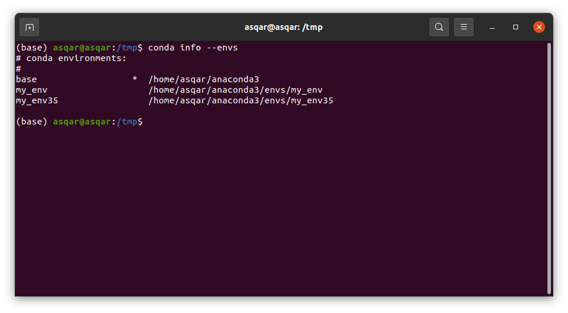

# Introduction
Anaconda is an open-source package manager, environment manager, and distribution of the Python and R programming languages. It is commonly used for data science, machine learning, large-scale data processing, scientific computing, and predictive analytics.

Offering a collection of over 1,000 data science packages, Anaconda is available in both free and paid enterprise versions. The Anaconda distribution ships with the conda command-line utility. You can learn more about Anaconda and conda by reading the official Anaconda Documentation.

This tutorial will guide you through installing the Python 3 version of Anaconda on an Ubuntu 20.04 server.

# Prerequisites
Before you begin with this guide, you should have a non-root user with sudo privileges set up on your server.

You can achieve this prerequisite by completing our Ubuntu 20.04 initial server setup guide.

# Installing Anaconda
The best way to install Anaconda is to download the latest Anaconda installer bash script, verify it, and then run it.

Find the latest version of Anaconda for Python 3 at the Anaconda Downloads page. At the time of writing, the latest version is 2020.02, but you should use a later stable version if it is available.

Next, change to the /tmp directory on your server. This is a good directory to download ephemeral items, like the Anaconda bash script, which we won’t need after running it.

```sh
cd /tmp
```


Use curl to download the link that you copied from the Anaconda website. We’ll output this to a file called anaconda.sh for quicker use.

```sh
curl https://repo.anaconda.com/archive/Anaconda3-2020.02-Linux-x86_64.sh --output anaconda.sh
```

We can now verify the data integrity of the installer with cryptographic hash verification through the SHA-256 checksum. We’ll use the sha256sum command along with the filename of the script:

```sh
sha256sum anaconda.sh
```

You’ll receive output that looks similar to this:


You should check the output against the hashes available at the Anaconda with Python 3 on 64-bit Linux page for your appropriate Anaconda version. As long as your output matches the hash displayed in the sha2561 row, you’re good to go.

Now we can run the script:

```sh
bash anaconda.sh
```

You’ll receive the following output:


Press ENTER to continue and then press ENTER to read through the license. Once you’re done reading the license, you’ll be prompted to approve the license terms:


As long as you agree, type yes.

At this point, you’ll be prompted to choose the location of the installation. You can press ENTER to accept the default location, or specify a different location to modify it.

The installation process will continue. Note that it may take some time.

Once installation is complete, you’ll receive the following output:


Type yes so that you can initialize Anaconda3. You’ll receive some output that states changes made in various directories. One of the lines you receive will thank you for installing Anaconda.

You can now activate the installation by sourcing the ~/.bashrc file:

```sh
source ~/.bashrc
```

Once you have done that, you’ll be placed into the default base programming environment of Anaconda, and your command prompt will change to be the following:

Although Anaconda ships with this default base programming environment, you should create separate environments for your programs and to keep them isolated from each other.

You can further verify your install by making use of the conda command, for example with list:


Now that Anaconda is installed, we can go on to setting up Anaconda environments.

# Setting Up Anaconda Environments
Anaconda virtual environments allow you to keep projects organized by Python versions and packages needed. For each Anaconda environment you set up, you can specify which version of Python to use and can keep all of your related programming files together within that directory.

First, we can check to see which versions of Python are available for us to use:

```sh
conda search "^python$"
```


You’ll receive output with the different versions of Python that you can target, including both Python 3 and Python 2 versions. Since we are using the Anaconda with Python 3 in this tutorial, you will have access only to the Python 3 versions of packages.

Let’s create an environment using the most recent version of Python 3. We can achieve this by assigning version 3 to the python argument. We’ll call the environment my_env, but you’ll likely want to use a more descriptive name for your environment especially if you are using environments to access more than one version of Python.

```sh
conda create --name my_env python=3
```


We’ll receive output with information about what is downloaded and which packages will be installed, and then be prompted to proceed with y or n. As long as you agree, type y.


The conda utility will now fetch the packages for the environment and let you know when it’s complete.

You can activate your new environment by typing the following:

```sh
conda activate my_env
```

With your environment activated, your command prompt prefix will reflect that you are no longer in the base environment, but in the new one that you just created.


Within the environment, you can verify that you’re using the version of Python that you had intended to use:

```sh
python --version
```


When you’re ready to deactivate your Anaconda environment, you can do so by typing:

```sh
conda deactivate
```


Note that you can replace the word source with . to achieve the same results.

To target a more specific version of Python, you can pass a specific version to the python argument, like 3.5, for example:

```sh
conda create -n my_env35 python=3.5
```


You can inspect all of the environments you have set up with this command:

```sh
conda info --envs
```



The asterisk indicates the current active environment.

Each environment you create with conda create will come with several default packages:

- _libgcc_mutex
- ca-certificates
- certifi
- libedit
- libffi
- libgcc-ng
- libstdcxx-ng
- ncurses
- openssl
- pip
- python
- readline
- -setuptools
- sqlite
- tk
- wheel
- xz
- zlib

You can add additional packages, such as numpy for example, with the following command:

```sh
conda install --name my_env35 numpy
```


If you know you would like a "numpy" environment upon creation, you can target it in your "conda create" command:

```sh
conda create --name my_env python=3 numpy
```


If you are no longer working on a specific project and have no further need for the associated environment, you can remove it. To do so, type the following:

```sh
conda remove --name my_env35 --all
```


Now, when you type the conda info --envs command, the environment that you removed will no longer be listed.

# Updating Anaconda
You should regularly ensure that Anaconda is up-to-date so that you are working with all the latest package releases.

To do this, you should first update the "conda" utility:

```sh
conda update conda
```


When prompted to do so, type y to proceed with the update.

Once the update of conda is complete, you can update the Anaconda distribution:

```sh
conda update anaconda
```


Again, when prompted to do so, type y to proceed.

This will ensure that you are using the latest releases of conda and Anaconda.

# Uninstalling Anaconda
If you are no longer using Anaconda and find that you need to uninstall it, you should start with the anaconda-clean module, which will remove configuration files for when you uninstall Anaconda.

```sh
conda install anaconda-clean
```


Type y when prompted to do so.

Once it is installed, you can run the following command. You will be prompted to answer y before deleting each one. If you would prefer not to be prompted, add --yes to the end of your command:

```sh
anaconda-clean
```

This will also create a backup folder called .anaconda_backup in your home directory:


You can now remove your entire Anaconda directory by entering the following command:

```sh
rm -rf ~/anaconda3
```

Finally, you can remove the PATH line from your .bashrc file that Anaconda added. To do so, first open a text editor such as nano:

```sh
nano ~/.bashrc
```


Then scroll down to the end of the file (if this is a recent install) or type CTRL + W to search for Anaconda. Delete or comment out this Anaconda block:

When you’re done editing the file, type CTRL + X to exit and y to save changes.

Anaconda is now removed from your server. If you did not deactivate the base programming environment, you can exit and re-enter the server to remove it.

# Conclusion

This tutorial walked you through the installation of Anaconda, working with the conda command-line utility, setting up environments, updating Anaconda, and deleting Anaconda if you no longer need it.

You can use Anaconda to help you manage workloads for data science, scientific computing, analytics, and large-scale data processing. From here, you can check out our tutorials on data analysis and machine learning to learn more about various tools available to use and projects that you can do.

We also have a free machine learning ebook available for download, Python Machine Learning Projects.