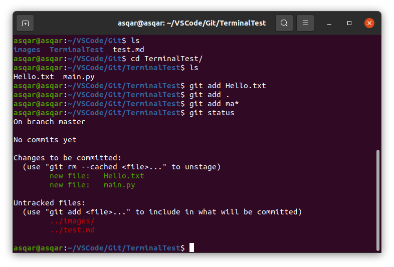

Git - bu tarqatilgan versiyani boshqarish tizimi bo'lib, u ishlab chiquvchilarga har qanday miqyosdagi loyihalarda hamkorlik qilishga yordam beradi.

Linux yadrosini ishlab chiqaruvchisi Linus Torvalds 2005 yilda Linux yadrosining rivojlanishini boshqarishga yordam berish uchun Gitni yaratdi.

# Tarqalgan versiyani boshqarish tizimi nima?
Tarqalgan versiyani boshqarish tizimi - bu sizning loyihangizdagi fayllarga kiritilgan o'zgarishlarni kuzatib borishga yordam beradigan tizim.

Bu oʻzgarishlar tarixi mahalliy kompyuteringizda saqlanadi va biror narsa notoʻgʻri boʻlgan taqdirda loyihangizning oldingi versiyasiga osongina qaytish imkonini beradi.

Git hamkorlikni osonlashtiradi. Jamoadagi har bir kishi o'z mahalliy mashinasida ishlayotgan omborlarining to'liq zaxira nusxasini saqlashi mumkin. Keyin BitBucket, GitHub yoki GitLab kabi tashqi server tufayli ular omborni bitta joyda xavfsiz saqlashlari mumkin.

Shunday qilib, jamoaning turli a'zolari uni mahalliy sifatida nusxalashlari mumkin va har bir kishi butun jamoa tomonidan kiritilgan barcha o'zgarishlarni aniq ko'rib chiqadi.

# Git konfiguratsiyasini qanday tekshirish mumkin:
Quyidagi buyruq git konfiguratsiyasi haqidagi ma'lumotlar ro'yxatini, jumladan foydalanuvchi nomi va elektron pochta manzilini qaytaradi:

```sh
git config -l
```


# Git foydalanuvchi nomini qanday sozlash mumkin:
Quyidagi buyruq yordamida foydalanuvchi nomingizni sozlashingiz mumkin:

```sh
git config --global user.name "AsqarTurdinazarov"
```

# Git foydalanuvchi elektron pochtangizni qanday sozlash mumkin:
Ushbu buyruq sizga o'z majburiyatlarida foydalanadigan foydalanuvchi elektron pochta manzilini sozlash imkonini beradi.

```sh
git config --global user.email "turdinazarovasqar355@gmail.com"
```

# Git-da login ma'lumotlaringizni qanday keshlash mumkin:
Kirish hisob ma'lumotlarini keshda saqlashingiz mumkin, shuning uchun ularni har safar kiritishingiz shart emas. Faqat bu buyruqdan foydalaning:

```sh
git config --global credential.helper cache
```

# Git repo qanday ishga tushiriladi:
Birinchi qadam, loyiha 'root' da yangi Git reponi ishga tushirishdir. Buni quyidagi buyruq bilan qilishingiz mumkin:

```sh
git init
```


# Git-dagi sahnalashtirish maydoniga faylni qanday qo'shish mumkin:
Quyidagi buyruq sahnalashtirish maydoniga fayl qo'shadi. Faqat filename_here ni sahnalash maydoniga qo'shmoqchi bo'lgan fayl nomi bilan almashtiring.

```sh
git add filename_here
```


# Git-dagi staging maydonidagi barcha fayllarni qanday qo'shish mumkin
Agar siz loyihangizdagi barcha fayllarni sahnalashtirish maydoniga qo'shmoqchi bo'lsangiz, wildcard belgidan foydalanishingiz mumkin. va har bir fayl siz uchun qo'shiladi.

```sh
git add .
```


Git-dagi sahnalashtirish maydoniga faqat ma'lum fayllarni qanday qo'shish mumkin
Quyidagi buyruqdagi yulduzcha bilan siz “fil” bilan boshlangan barcha fayllarni sahnalashtirish maydoniga qo‘shishingiz mumkin.

```sh
git add fil*
```

# Git-da ombor holatini qanday tekshirish mumkin:
Ushbu buyruq bosqichli, bosqichsiz va kuzatilmagan fayllarni o'z ichiga olgan joriy omborning holatini ko'rsatadi.

```sh
git status
```



#Git muharririda qanday o'zgarishlar qilish kerak:
Ushbu buyruq terminalda matn muharririni ochadi, u erda siz to'liq majburiyat xabarini yozishingiz mumkin.

Qabul qilingan xabar o'zgarishlarning qisqacha xulosasi, bo'sh qator va undan keyingi o'zgarishlarning to'liq tavsifidan iborat.

```sh
git commit
```


# Git-da xabar bilan qanday o'zgarishlar qilish kerak:
Siz muharrirni ochmasdan majburiy xabar qo'shishingiz mumkin. Bu buyruq sizga topshirilgan xabaringiz uchun faqat qisqacha xulosani belgilash imkonini beradi.

```sh
git commit -m "your commit message here"
```

# Git-da qanday o'zgartirishlar kiritish (va sahnalashtirish maydonini o'tkazib yuborish):
Siz -a va -m opsiyalaridan foydalanib, bitta buyruq bilan kuzatilgan fayllarni qo'shishingiz va topshirishingiz mumkin.

```sh
git commit -a -m"your commit message here"
```


# Git-da topshiriqlaringiz tarixini qanday ko'rish mumkin:
Ushbu buyruq joriy ombor uchun topshirish tarixini ko'rsatadi:

```sh
git log
```


# Git-dagi o'zgarishlarni o'z ichiga olgan majburiyatlaringiz tarixini qanday ko'rish mumkin:
Ushbu buyruq barcha fayllar va ularning o'zgarishlarini o'z ichiga olgan majburiyat tarixini ko'rsatadi:

```sh
git log -p
```


# Git-da ma'lum bir majburiyatni qanday ko'rish mumkin:
Ushbu buyruq ma'lum bir majburiyatni ko'rsatadi.

commit-identifikatorini 'commit' so‘zidan keyin majburiyat jurnalida topilgan majburiyat identifikatori bilan almashtiring.

```sh
git show commit-id
```


# Git-da jurnal statistikasini qanday ko'rish mumkin:
Ushbu buyruq Git jurnalida har bir topshiriqdagi o'zgarishlar, jumladan o'zgartirilgan satr(lar) va fayl nomlari haqida ba'zi statistik ma'lumotlarni ko'rsatishiga olib keladi.

```sh
git log --stat
```


# Git-da "diff" yordamida amalga oshirilgan o'zgarishlarni qanday ko'rish mumkin:
Siz faylni faqat ma'lum bir fayldagi o'zgarishlarni ko'rish uchun parametr sifatida topshirishingiz mumkin.
"git diff" sukut bo'yicha faqat bosqichsiz o'zgarishlarni ko'rsatadi.

Bosqichli o'zgarishlarni ko'rish uchun "--stage" bayrog'i bilan "diff" ni chaqirishimiz mumkin.

```sh
git diff
git diff all_checks.py
git diff --staged
```

# "git add -p" yordamida o'zgarishlarni qanday ko'rish mumkin:
Bu buyruq taklifni ochadi va siz o'zgarishlarni amalga oshirishni xohlaysizmi yoki yo'qmi, deb so'raydi va boshqa variantlarni o'z ichiga oladi.

```sh
git add -p
```


# Git-dagi joriy ishlaydigan daraxtdan kuzatilgan fayllarni qanday olib tashlash mumkin:
Ushbu buyruq fayl nima uchun o'chirilganligini tushuntirish uchun majburiyat xabarini kutadi.

```sh
git rm filename
```


# Git-da fayllar nomini qanday o'zgartirish mumkin:
Ushbu buyruq o'zgarishlarni bosqichma-bosqich amalga oshiradi, keyin u majburiyat xabarini kutadi.

```sh
git mv oldfile newfile
```


# Git-dagi fayllarni qanday e'tiborsiz qoldirish mumkin:
".gitignore" faylini yarating va uni bajaring.

# Git-da bosqichsiz o'zgarishlarni qanday qaytarish mumkin:

```sh
git checkout filename
```

# Git-dagi bosqichma-bosqich o'zgarishlarni qanday qaytarish mumkin:
Qayta o'rnatmoqchi bo'lgan o'zgarishlarni belgilash uchun -p parametr bayrog'idan foydalanishingiz mumkin.

```sh
git reset HEAD filename
git reset HEAD -p
```

# Git-dagi eng so'nggi majburiyatni qanday o'zgartirish mumkin:
"git commit --amend" sizga eng so'nggi topshiriqni o'zgartirish va o'zgartirishlar kiritish imkonini beradi.

```sh
git commit --amend
```

!!Eslatma!!: mahalliy majburiyatni tuzatish bilan tuzatish juda yaxshi va uni tuzatganingizdan so'ng uni umumiy omborga surishingiz mumkin. Lekin siz allaqachon e'lon qilingan majburiyatlarni o'zgartirishdan qochishingiz kerak.

# Git-dagi oxirgi topshiriqni qanday qaytarish mumkin:
"git revert" berilgan topshiriqdagi hamma narsaga qarama-qarshi bo'lgan yangi majburiyat yaratadi.
Biz bosh taxallusdan foydalanib, oxirgi majburiyatni quyidagicha qaytarishimiz mumkin:

```sh
git revert HEAD
```

# Gitdagi eski majburiyatni qanday qaytarish mumkin:
Qadimgi majburiyatni uning identifikatori yordamida qaytarishingiz mumkin. Bu muharrirni ochadi, shuning uchun siz majburiyat xabarini qo'shishingiz mumkin.

```sh
git revert comit_id_here
```

# Git-da yangi filialni qanday yaratish mumkin:
Odatiy bo'lib, sizda bitta filial, asosiy filial mavjud. Ushbu buyruq yordamida siz yangi filial yaratishingiz mumkin. Git unga avtomatik ravishda o'tmaydi - keyingi buyruq bilan buni qo'lda qilishingiz kerak bo'ladi.

```sh
git branch branch_name
```

# Git-da yangi yaratilgan filialga qanday o'tish mumkin:
Boshqa yoki yangi yaratilgan filialdan foydalanmoqchi bo'lsangiz, ushbu buyruqdan foydalanishingiz mumkin:

```sh
git checkout branch_name
```

# Git-da filiallarni qanday ro'yxatga olish mumkin:
Siz barcha yaratilgan filiallarni "git filiali" buyrug'i yordamida ko'rishingiz mumkin. U barcha filiallar ro'yxatini ko'rsatadi va joriy filialni yulduzcha bilan belgilab, yashil rang bilan ajratib ko'rsatadi.

```sh
git branch
```

# Git-da qanday qilib filial yaratish va darhol unga o'tish mumkin:
Bitta buyruqda siz darhol yangi filial yaratishingiz va unga o'tishingiz mumkin.

```sh
git checkout -b branch_name
```

# Git-da filialni qanday o'chirish mumkin:
Filial bilan ishlashni tugatib, uni birlashtirgandan so'ng, uni quyidagi buyruq yordamida o'chirishingiz mumkin:

```sh
git branch -d branch_name
```

# Git-da ikkita filialni qanday birlashtirish mumkin:
Siz hozir bo'lgan filial tarixini "branch_name" bilan birlashtirish uchun quyidagi buyruqni ishlatishingiz kerak bo'ladi:

```sh
git merge branch_name
```

# Git-da topshiriqlar jurnalini grafik sifatida qanday ko'rsatish mumkin:
Biz majburiyat jurnalini grafik sifatida ko'rsatish uchun "--graph" dan foydalanishimiz mumkin. Shuningdek,
"--oneline" xabarlarni bitta satr bilan cheklaydi.

```sh
git log --graph --oneline
```

# Qanday qilib topshiriqlar jurnalini Git-dagi barcha filiallarning grafigi sifatida ko'rsatish mumkin:
Yuqoridagi buyruq bilan bir xil ishlaydi, lekin barcha filiallar uchun.

```sh
git log --graph --oneline --all
```

# Gitda ziddiyatli birlashishni qanday bekor qilish mumkin:
Agar siz birlashmani tashlab, qaytadan boshlamoqchi bo'lsangiz, quyidagi buyruqni bajarishingiz mumkin:

```sh
git merge --abort
```

# Git-ga masofaviy omborni qanday qo'shish mumkin
Ushbu buyruq mahalliy omboringizga masofaviy omborni qo'shadi (shunchaki "https://repo_here" ni masofaviy repo URL manzili bilan almashtiring).

```sh
git add remote https://repo_here
```

# Git-da masofaviy URL-manzillarni qanday ko'rish mumkin:
Mahalliy omboringiz uchun barcha masofaviy omborlarni ushbu buyruq bilan ko'rishingiz mumkin:

```sh
git remote -v
```

# Git-da masofaviy repo haqida ko'proq ma'lumotni qanday olish mumkin:
Faqat "origin" ni olingan masofadan boshqarish pulti nomi bilan almashtiring
'git remote -v' buyrug'ini ishga tushirish.

```sh
git remote show origin
```

# Git-dagi masofaviy repoga qanday o'zgartirishlar kiritish mumkin:
Barcha ishlaringiz masofaviy omborga saqlashga tayyor bo'lgach, quyidagi buyruq yordamida barcha o'zgarishlarni surishingiz mumkin:

```sh
git push
```

# Git-dagi masofaviy repodan o'zgarishlarni qanday olish mumkin:
Agar boshqa jamoa a'zolari sizning omboringiz ustida ishlayotgan bo'lsa, siz quyidagi buyruq yordamida masofaviy omborga kiritilgan so'nggi o'zgarishlarni olishingiz mumkin:

```sh
git pull
```

# Git kuzatayotgan masofaviy filiallarni qanday tekshirish mumkin:
Bu buyruq Git joriy ombor uchun kuzatayotgan barcha uzoq filiallarning nomini ko'rsatadi:

```sh
git branch -r
```

# Git-da masofaviy repo o'zgarishlarini qanday olish mumkin:
Ushbu buyruq o'zgarishlarni masofaviy repodan yuklab oladi, lekin mahalliy filialingizda birlashtirmaydi (chunki git pull o'rniga buni amalga oshiradi).

```sh
git fetch
```

# Git-da masofaviy reponing joriy topshiriqlar jurnalini qanday tekshirish mumkin
Amalga oshirilgandan keyin bajaring, Git jurnal tuzadi. Ushbu buyruq yordamida masofaviy ombor jurnalini bilib olishingiz mumkin:

```sh
git log origin/main
```

# Git-dagi mahalliy repo bilan masofaviy repo qanday birlashtirish mumkin:
Agar masofaviy omborda mahalliy bilan birlashmoqchi bo'lgan o'zgarishlar bo'lsa, bu buyruq siz uchun buni amalga oshiradi:

```sh
git merge origin/main
```

# Git-dagi masofaviy filiallar tarkibini avtomatik birlashtirmasdan qanday olish mumkin:
Bu sizga hech qanday tarkibni birlashtirmasdan pultni yangilash imkonini beradi
mahalliy filiallar. Birlashtirishni amalga oshirish uchun siz git merge yoki git checkout-ni chaqirishingiz mumkin.

```sh
git remote update
```

# Git-da uzoq repoga yangi filialni qanday surish mumkin:
Agar siz filialni uzoq omborga o'tkazmoqchi bo'lsangiz, quyidagi buyruqdan foydalanishingiz mumkin. Yuqori oqimdagi filialni yaratish uchun '-u'qo'shishni unutmang:

```sh
git push -u origin branch_name
```

# Git-dagi masofaviy filialni qanday olib tashlash mumkin:
Agar sizga masofaviy filial kerak bo'lmasa, uni quyidagi buyruq yordamida olib tashlashingiz mumkin:

```sh
git push --delete origin branch_name_here
```

# Git rebase-dan qanday foydalanish kerak:
Siz "git rebase" yordamida tugallangan ishni bir filialdan boshqasiga o'tkazishingiz mumkin.

```sh
git rebase branch_name_here
```

Agar siz buni to'g'ri bajarmasangiz, 'Git Rebase' juda chalkash bo'lishi mumkin. Ushbu buyruqni ishlatishdan oldin bu erda rasmiy hujjatlarni qayta o'qib chiqishingizni maslahat beraman

# Git-da rebase-ni interaktiv tarzda qanday ishlatish mumkin:
Siz -i bayrog'i yordamida git 'rebase' ni interaktiv tarzda ishga tushirishingiz mumkin.
U muharrirni ochadi va siz foydalanishingiz mumkin bo'lgan buyruqlar to'plamini taqdim etadi.

```sh
git rebase -i master
# p, pick = use commit
# r, reword = use commit, but edit the commit message
# e, edit = use commit, but stop for amending
# s, squash = use commit, but meld into previous commit
# f, fixup = like "squash", but discard this commit's log message
# x, exec = run command (the rest of the line) using shell
# d, drop = remove commit
```

# Git-da surish so'rovini qanday majburlash mumkin:
Ushbu buyruq "push" so'rovini majbur qiladi. Bu odatda "pull" so'rov shoxlari uchun yaxshi, chunki ularni boshqa hech kim klonlashi kerak emas.
Lekin bu siz ommaviy reposlar bilan qilishni xohlaydigan narsa emas.

```sh
git push -f
```

